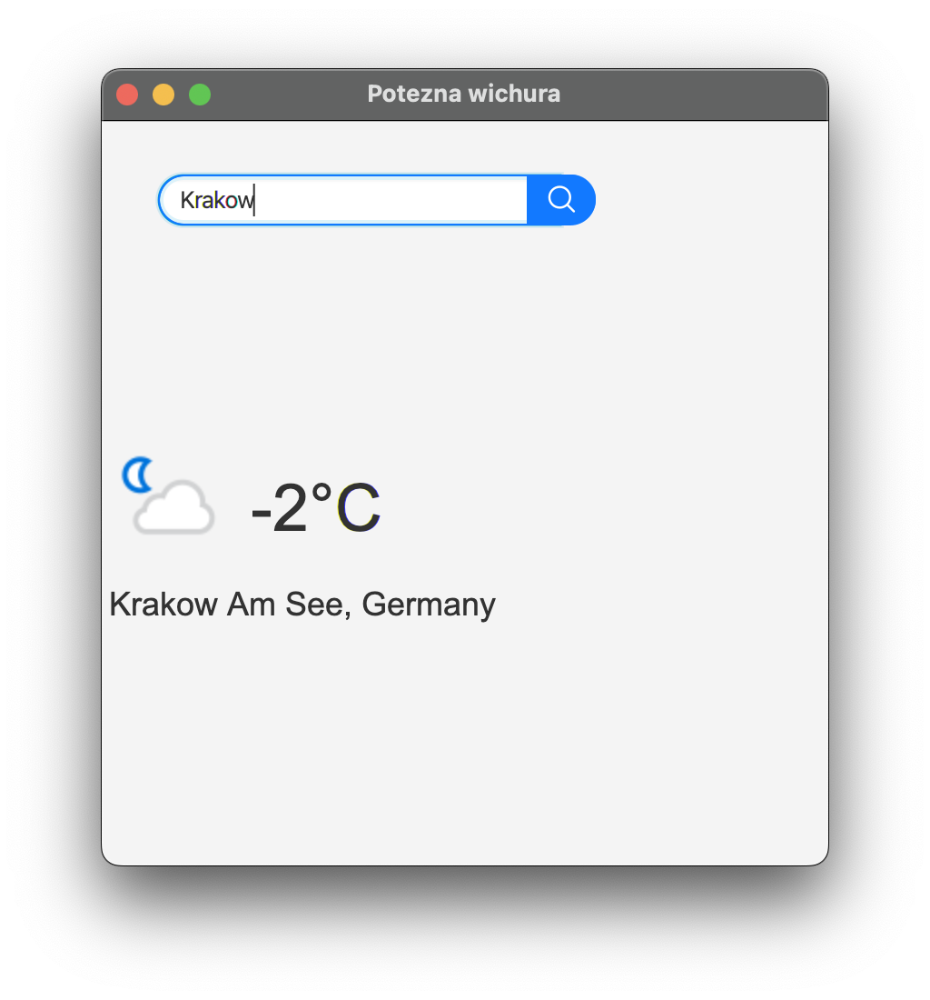
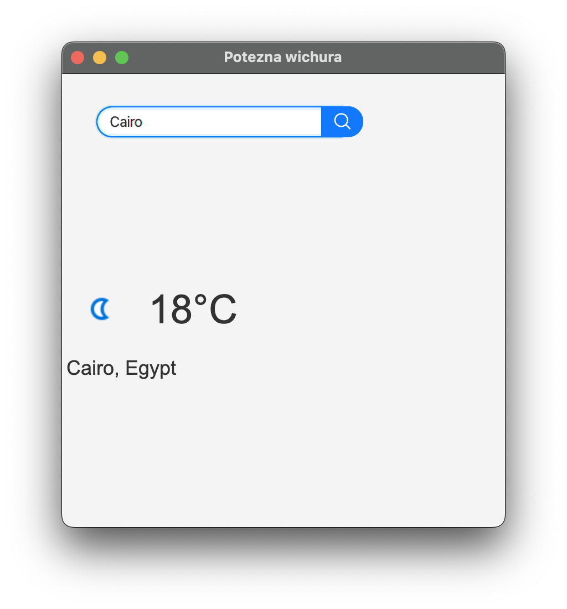

# Milestone 1 - basic application and connection with remote API

## Used technologies
- JavaFX;
- Spring (dependency injection and reading properties);
- Gson (JSON parser);
- JUnit 5 (unit tests);
- Mockito (unit and GUI tests);
- TestFX (GUI tests).

## Application preview

### Demo

  

### Screenshots

  

  

  

  

  

  

## Application UML class diagram

  

